# CR TP N1 - Initiation & Remise à niveau SQL - Pommereul Noa

## Requêtes classiques

### 1. Afficher tous les livres de la base de données

**Requête :**

```sql
SELECT * FROM livres;
```

**Résultat**
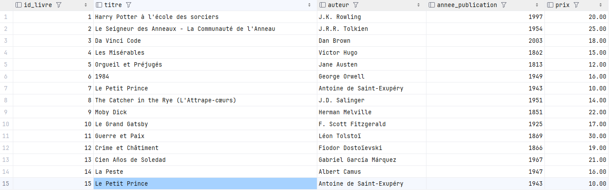

## 2. Afficher tous les clients de la base de données

**Requête :**

```sql
SELECT * FROM clients;
```

**Résultat**
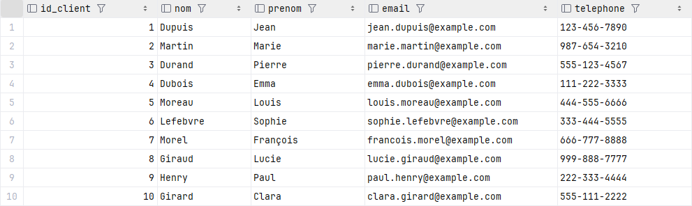

## 3. Afficher tous les emprunts enregistrés dans la base de données

**Requête :**

```sql
SELECT * FROM emprunts;
```

**Résultat**
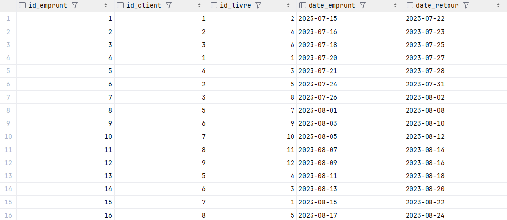

## 4. Sélectionner et afficher uniquement les livres publiés après l'an 2000

**Requête :**

```sql
SELECT * FROM livres WHERE annee_publication > 2000;
```

**Résultat :**
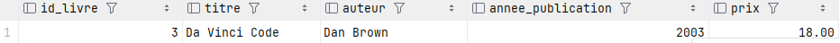

## 5. Sélectionner et afficher les clients dont le nom commence par "Dupuis"

**Requête :**

```sql
SELECT * FROM clients WHERE nom LIKE 'Dupuis%';
```

**Résultat :**
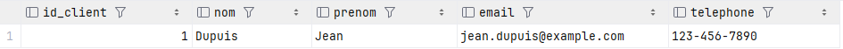

## 6. Afficher les livres empruntés par un client donné (filtrer par son nom et prénom)

**Requête :**

```sql
CREATE OR REPLACE FUNCTION livres_empruntes_par_client(nom_client TEXT, prenom_client TEXT)
RETURNS TABLE(titre VARCHAR, auteur VARCHAR, annee_publication INT) AS $$
BEGIN
    RETURN QUERY
    SELECT l.titre, l.auteur, l.annee_publication
    FROM livres l
    JOIN emprunts e ON l.id_livre = e.id_livre
    JOIN clients c ON e.id_client = c.id_client
    WHERE c.nom = nom_client AND c.prenom = prenom_client;
END;
$$ LANGUAGE plpgsql;
```

**Exemple d'utilisation :**

```sql
SELECT * FROM livres_empruntes_par_client('Dupuis', 'Jean');
```

**Résultat :**
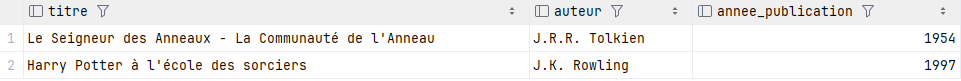

## 7. Afficher les clients qui n'ont jamais emprunté de livre

**Requête :**

```sql
SELECT * FROM clients c
LEFT JOIN emprunts e ON c.id_client = e.id_client
WHERE e.id_client IS NULL;
```

**Résultat :**
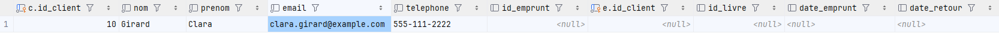

## 8. Calculer le nombre total de livres dans la base de données

**Requête :**

```sql
SELECT COUNT(*) AS total_livres FROM livres;
```

**Résultat :**
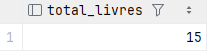

## 9. Calculer le nombre de clients enregistrés dans la base de données

**Requête :**

```sql
SELECT COUNT(*) AS total_clients FROM clients;
```

**Résultat :**
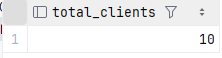

## 10. Calculer le nombre d'emprunts enregistrés dans la base de données

**Requête :**

```sql
SELECT COUNT(*) AS total_emprunts FROM emprunts;
```

**Résultat :**
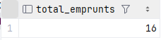

## Pour aller plus loin

## 1. Partitionnement par date

```sql
CREATE TABLE livres_partitionnes (
    id_livre SERIAL,
    titre VARCHAR(255) NOT NULL,
    auteur VARCHAR(255) NOT NULL,
    annee_publication INT NOT NULL,
    PRIMARY KEY (annee_publication, id_livre)
) PARTITION BY RANGE (annee_publication);

CREATE TABLE livres_avant_2000 PARTITION OF livres_partitionnes
    FOR VALUES FROM (0) TO (2000);

CREATE TABLE livres_2000_2010 PARTITION OF livres_partitionnes
    FOR VALUES FROM (2000) TO (2010);

CREATE TABLE livres_apres_2010 PARTITION OF livres_partitionnes
    FOR VALUES FROM (2010) TO (2025);

INSERT INTO livres_partitionnes (id_livre, titre, auteur, annee_publication)

SELECT id_livre, titre, auteur, annee_publication FROM livres;
```

## 2. Interrogation des partitions

**Requête :**

```sql
INSERT INTO livres_partitionnes (titre, auteur, annee_publication) VALUES ('Nouveau Livre', 'Nouvel Auteur', 2015);
SELECT * FROM livres_apres_2010;
```

**Résultat :**
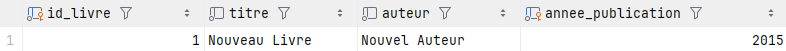

## 3. Calcul des performances du partitionnement

**Requête :**

```sql
EXPLAIN ANALYZE SELECT * FROM livres;
EXPLAIN ANALYZE SELECT * FROM livres_partitionnes;
```

**Résultat :**
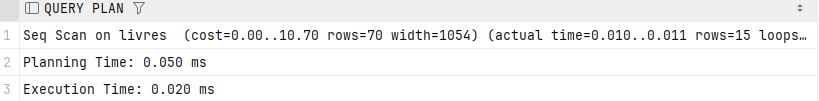
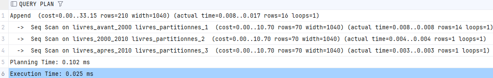

## 4. Requête complexe avec jointures

**Requête :**

```sql
SELECT l.titre, l.auteur, l.annee_publication, c.nom || ' ' || c.prenom AS nom_complet
FROM livres l
JOIN emprunts e ON l.id_livre = e.id_livre
JOIN clients c ON e.id_client = c.id_client
WHERE c.email = 'marie.martin@example.com';
```

**Résultat :**
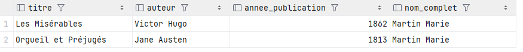

## 5. Requête de sous-requête

## 6. Optimisation des requêtes

## 7. Utilisation de CTE (Common Table Expressions)

## 8. Manipulation de chaînes de caractères

## 9. Requête récursive

## 10. Utilisation d'agrégations avancées
