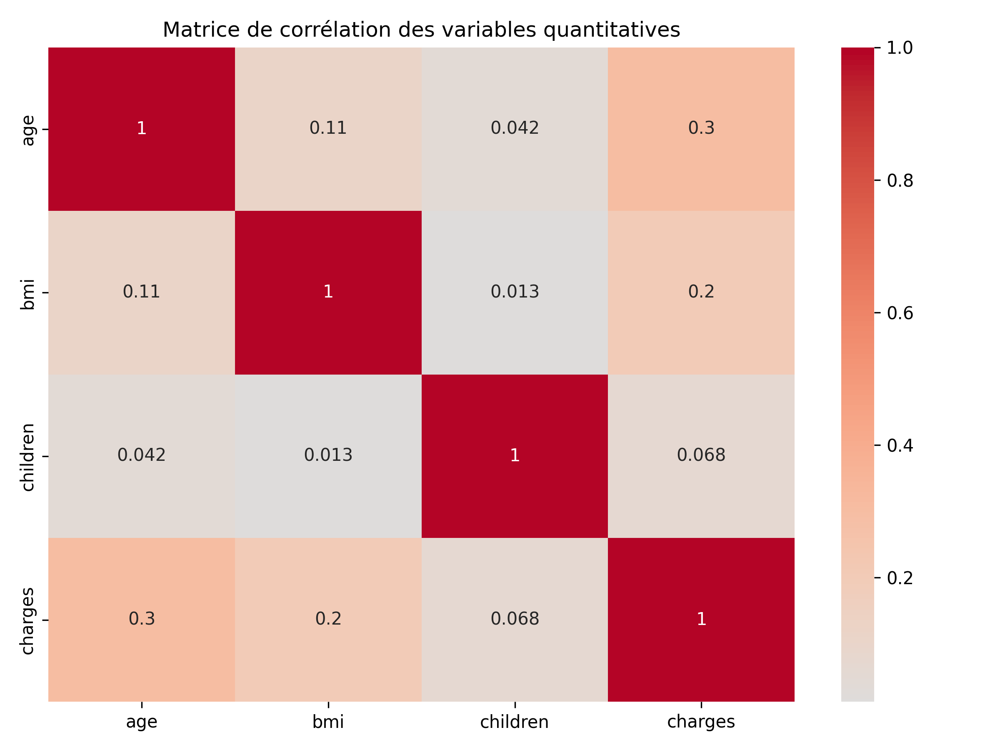
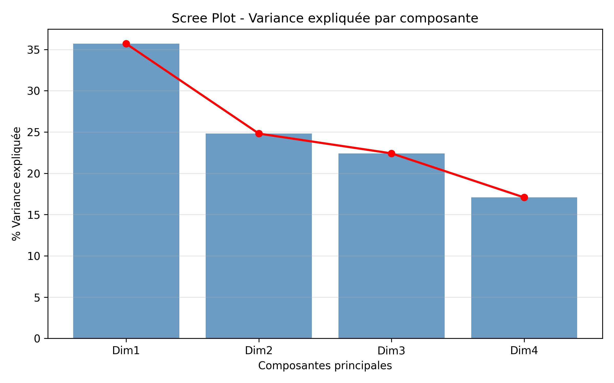
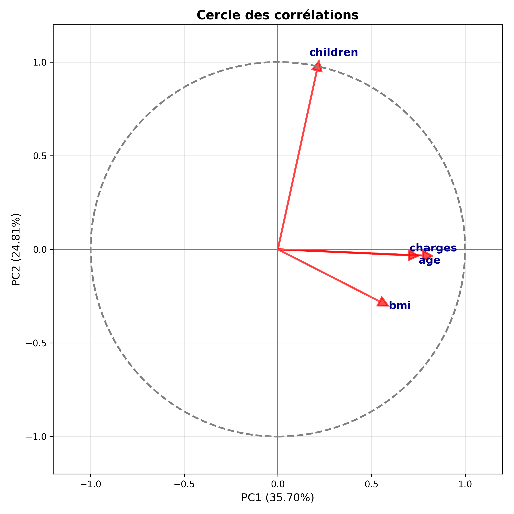
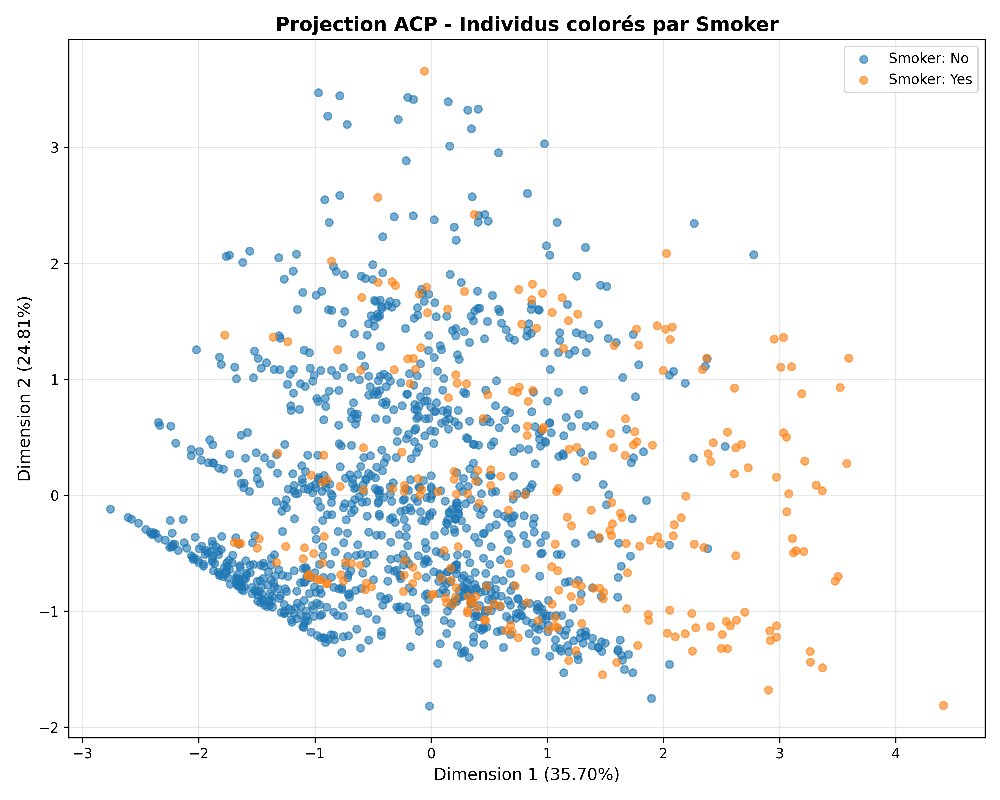
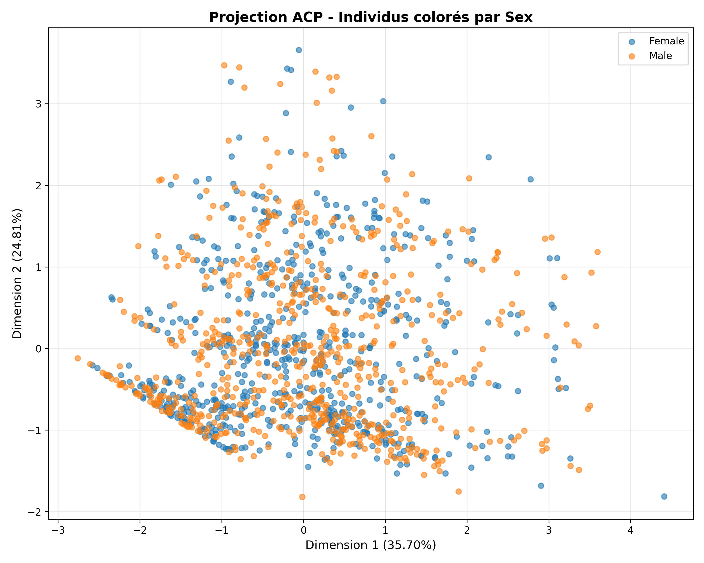
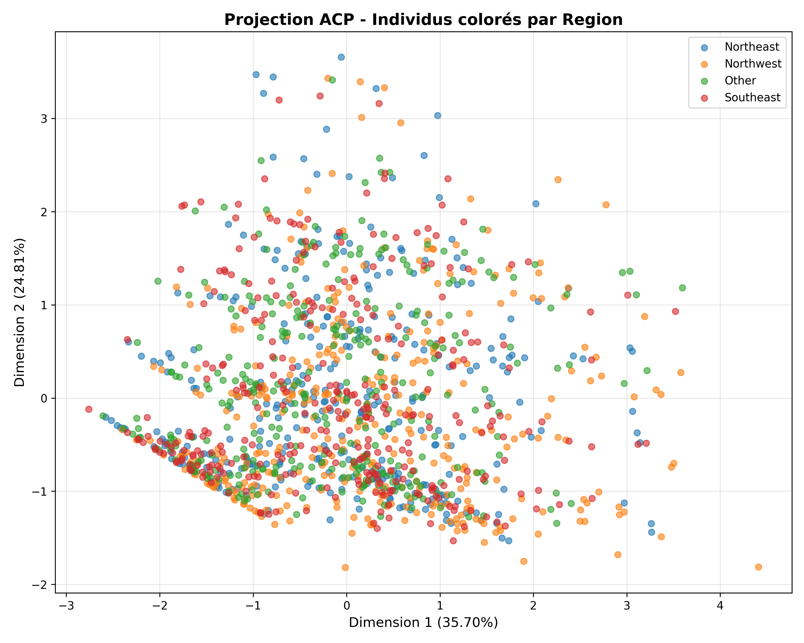
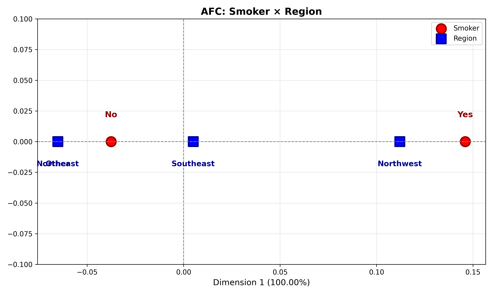
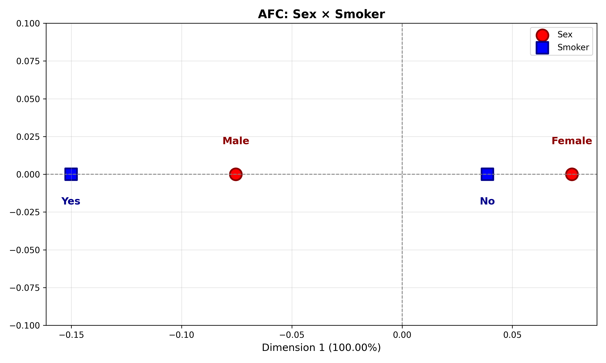
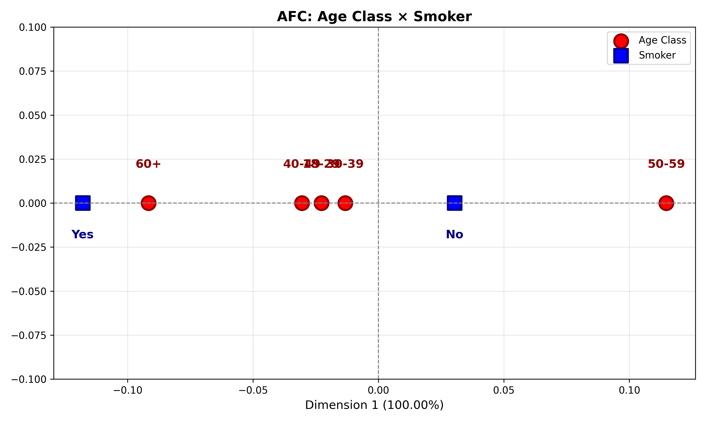

# Compte Rendu d'Analyse - Dataset Insurance

**Auteurs :** Pommereul Mabit  
**Date :** Octobre 2025  
**Projet :** Analyse exploratoire, ACP et AFC du dataset insurance.csv

---

## Sommaire

1. [Contexte et objectifs](#1-contexte-et-objectifs)
2. [Jeu de données et préparation](#2-jeu-de-données-et-préparation)
3. [Analyse exploratoire](#3-analyse-exploratoire)
   - 3.1 [Statistiques descriptives](#31-statistiques-descriptives)
   - 3.2 [Matrice de corrélation](#32-matrice-de-corrélation)
4. [Analyse en Composantes Principales (ACP)](#4-analyse-en-composantes-principales-acp)
   - 4.1 [Méthodologie](#41-méthodologie)
   - 4.2 [Valeurs propres et variance expliquée](#42-valeurs-propres-et-variance-expliquée)
   - 4.3 [Cercle des corrélations](#43-cercle-des-corrélations)
   - 4.4 [Projection des individus](#44-projection-des-individus)
5. [Analyse Factorielle des Correspondances (AFC)](#5-analyse-factorielle-des-correspondances-afc)
   - 5.1 [Smoker × Region](#51-smoker--region)
   - 5.2 [Sex × Smoker](#52-sex--smoker)
   - 5.3 [Age Class × Smoker](#53-age-class--smoker)
6. [Synthèse et conclusions](#6-synthèse-et-conclusions)
7. [Annexes](#7-annexes)

---

## 1. Contexte et objectifs

Ce rapport présente une analyse statistique multivariée du jeu de données **insurance.csv**, qui contient des informations sur les coûts d'assurance santé de 1338 individus. L'objectif est d'explorer la structure des données à travers :

- Une **Analyse en Composantes Principales (ACP)** pour identifier les relations entre les variables quantitatives et réduire la dimensionnalité.
- Une **Analyse Factorielle des Correspondances (AFC)** pour étudier les associations entre variables qualitatives.

Cette analyse vise à identifier les principaux facteurs influençant les charges d'assurance et à détecter d'éventuels profils types d'assurés.

---

## 2. Jeu de données et préparation

### 2.1 Description des variables

Le dataset contient **1338 observations** et **7 variables** :

| Variable   | Type        | Description                                          |
|------------|-------------|------------------------------------------------------|
| `age`      | Quantitative| Âge de l'assuré (18-64 ans)                          |
| `sex`      | Qualitative | Sexe (0 = Female, 1 = Male)                          |
| `bmi`      | Quantitative| Indice de Masse Corporelle                           |
| `children` | Quantitative| Nombre d'enfants à charge                            |
| `smoker`   | Qualitative | Statut fumeur (0 = No, 1 = Yes)                      |
| `region`   | Qualitative | Région géographique (1-4)                            |
| `charges`  | Quantitative| Coûts annuels d'assurance santé (USD)                |

### 2.2 Prétraitements

- **Vérification des valeurs manquantes** : Aucune valeur manquante détectée.
- **Encodage des variables qualitatives** : Transformation en catégories pour les visualisations.
  - `sex` : Female / Male
  - `smoker` : No / Yes
  - `region` : Southeast / Northwest / Northeast / Other
- **Standardisation** : Centrage-réduction des variables quantitatives pour l'ACP (`age`, `bmi`, `children`, `charges`).
- **Discrétisation** : Création de classes d'âge pour l'AFC :
  - 18-29 ans
  - 30-39 ans
  - 40-49 ans
  - 50-59 ans
  - 60+ ans

---

## 3. Analyse exploratoire

### 3.1 Statistiques descriptives

**Variables quantitatives** :

| Variable   | Moyenne  | Écart-type | Min      | Max        |
|------------|----------|------------|----------|------------|
| `age`      | 39.21    | 14.05      | 18.00    | 64.00      |
| `bmi`      | —        | —          | —        | —          |
| `children` | —        | —          | 0        | —          |
| `charges`  | 13270.42 | 12110.01   | 1121.87  | 63770.43   |

**Variables qualitatives** :

- **Sex** : Male (676), Female (662) — distribution équilibrée
- **Smoker** : No (1064), Yes (274) — ~20% de fumeurs
- **Region** : Northwest (364), Northeast (325), Other (325), Southeast (324) — distribution équilibrée

### 3.2 Matrice de corrélation

  
**Figure 1** — Matrice de corrélation (Pearson) entre les variables quantitatives.

**Observations** :

- **`charges` et `age`** : corrélation positive modérée (r = 0.30), suggérant que les coûts augmentent avec l'âge.
- **`charges` et `bmi`** : corrélation positive faible (r = 0.20), indiquant un lien entre surpoids et coûts.
- **`children`** : corrélation très faible avec `charges` (r = 0.07), impact limité du nombre d'enfants.
- **`age`, `bmi`, `children`** : corrélations inter-variables très faibles, suggérant une relative indépendance.

---

## 4. Analyse en Composantes Principales (ACP)

### 4.1 Méthodologie

L'ACP est réalisée sur les **4 variables quantitatives** après standardisation (centrage-réduction) :
- `age`
- `bmi`
- `children`
- `charges`

L'objectif est de réduire la dimensionnalité tout en conservant l'information essentielle.

### 4.2 Valeurs propres et variance expliquée

  
**Figure 2** — Éboulis des valeurs propres (pourcentage de variance expliquée par composante).

**Résultats** :

| Dimension | Valeur propre | % Variance | % Cumulé |
|-----------|---------------|------------|----------|
| Dim1      | 1.429         | 35.70%     | 35.70%   |
| Dim2      | 0.993         | 24.81%     | 60.51%   |
| Dim3      | 0.897         | 22.41%     | 82.93%   |
| Dim4      | 0.683         | 17.07%     | 100.00%  |

**Interprétation** :

- Les **deux premières composantes** expliquent **60.51%** de la variance totale.
- Le critère du coude suggère de retenir **2 ou 3 dimensions** pour l'analyse.
- **Dim1** (35.70%) semble capturer un axe lié aux charges et à l'âge.
- **Dim2** (24.81%) capture une information complémentaire, possiblement liée au nombre d'enfants.

### 4.3 Cercle des corrélations

  
**Figure 3** — Cercle des corrélations des variables sur les axes factoriels Dim1 et Dim2.

**Contributions des variables aux axes** :

| Variable   | Contrib. Dim1 | Contrib. Dim2 |
|------------|---------------|---------------|
| `age`      | 34.32%        | 0.10%         |
| `bmi`      | 20.69%        | 7.79%         |
| `children` | 3.05%         | 92.00%        |
| `charges`  | 41.95%        | 0.11%         |

**Interprétation** :

- **Axe 1 (Dim1)** : fortement défini par `charges` (41.95%) et `age` (34.32%), avec une contribution secondaire de `bmi` (20.69%). Cet axe représente un **gradient de coût/risque** : les individus avec des charges élevées et un âge avancé se projettent sur la partie positive de l'axe.

- **Axe 2 (Dim2)** : quasi-exclusivement défini par `children` (92.00%). Cet axe oppose les individus avec et sans enfants à charge, indépendamment de leur niveau de charges.

- La **qualité de représentation** (proximité au cercle) est excellente pour `charges`, `age` et `children` sur le plan (Dim1, Dim2), mais plus modérée pour `bmi`.

### 4.4 Projection des individus

#### a) Coloration par Smoker

  
**Figure 4** — Projection des individus sur (Dim1, Dim2), coloration par statut fumeur.

**Observations** :

- **Séparation nette** entre fumeurs (Yes) et non-fumeurs (No) le long de **Dim1**.
- Les **fumeurs** tendent à se projeter vers des valeurs **positives** de Dim1, cohérent avec des charges plus élevées.
- Cette observation suggère que le statut fumeur est un **facteur déterminant** des coûts d'assurance, même si cette variable n'a pas été utilisée directement dans l'ACP (effet via `charges`).

#### b) Coloration par Sex

  
**Figure 5** — Projection des individus sur (Dim1, Dim2), coloration par sexe.

**Observations** :

- **Pas de séparation marquée** entre hommes et femmes sur les deux premiers axes.
- La variabilité **intra-genre** est bien plus importante que la variabilité inter-genres.
- Le sexe ne semble **pas être un facteur structurant** de la variance capturée par l'ACP.

#### c) Coloration par Region

  
**Figure 6** — Projection des individus sur (Dim1, Dim2), coloration par région.

**Observations** :

- Les différentes régions se **superposent largement** sur le plan factoriel.
- Aucun **clustering géographique** n'est visible.
- La région géographique ne constitue **pas un facteur discriminant** dans la structure de variance des variables quantitatives.

---

## 5. Analyse Factorielle des Correspondances (AFC)

L'AFC permet d'étudier les **associations entre variables qualitatives** via des tableaux de contingence. Les coordonnées factorielles des modalités lignes et colonnes sont projetées sur un plan pour visualiser les proximités.

### 5.1 Smoker × Region

  
**Figure 7** — Carte factorielle AFC des modalités smoker et region.

**Tableau de contingence** :

| smoker \ region | Southeast | Northwest | Northeast | Other |
|-----------------|-----------|-----------|-----------|-------|
| No              | 257       | 273       | 267       | 267   |
| Yes             | 67        | 91        | 58        | 58    |

**Test du Chi²** :
- χ² = 7.34, p-value = 0.062 (non significatif au seuil α = 0.05)

**Interprétation** :

- L'association entre région et statut fumeur est **marginalement non significative** (p = 0.062).
- **Northwest** semble légèrement surreprésentée chez les fumeurs (91 vs. attendu ~68 si indépendance).
- L'AFC ne révèle qu'**une seule dimension** (100% d'inertie), ce qui suggère une structure simple : une opposition globale fumeurs/non-fumeurs avec un effet régional modeste.

### 5.2 Sex × Smoker

  
**Figure 8** — Carte factorielle AFC des modalités sex et smoker.

**Tableau de contingence** :

| sex \ smoker | No  | Yes |
|--------------|-----|-----|
| Female       | 547 | 115 |
| Male         | 517 | 159 |

**Test du Chi²** :
- χ² = 7.39, p-value = 0.007 (**significatif** au seuil α = 0.01)

**Interprétation** :

- L'association entre sexe et statut fumeur est **statistiquement significative**.
- Les **hommes** ont une proportion de fumeurs légèrement **supérieure** (159/676 = 23.5%) comparé aux femmes (115/662 = 17.4%).
- Graphiquement (1D), les modalités "Male" et "Yes" sont proches, tout comme "Female" et "No", confirmant cette association.

### 5.3 Age Class × Smoker

  
**Figure 9** — Carte factorielle AFC des classes d'âge et du statut fumeur.

**Tableau de contingence** :

| age_class \ smoker | No  | Yes |
|--------------------|-----|-----|
| 18-29              | 349 | 95  |
| 30-39              | 203 | 54  |
| 40-49              | 220 | 61  |
| 50-59              | 223 | 42  |
| 60+                | 69  | 22  |

**Test du Chi²** :
- χ² = 4.79, p-value = 0.31 (non significatif)

**Interprétation** :

- **Pas d'association significative** entre classe d'âge et statut fumeur (p = 0.31).
- La proportion de fumeurs est relativement **stable** à travers les tranches d'âge (~20-25%).
- L'AFC révèle une seule dimension (100% d'inertie), reflétant essentiellement l'opposition fumeurs/non-fumeurs sans gradient marqué selon l'âge.

---

## 6. Synthèse et conclusions

### 6.1 Principaux enseignements

**ACP (variables quantitatives)** :

1. **Axe principal (Dim1, 35.7%)** : gradient de coût/risque piloté par `charges` et `age`, avec contribution secondaire de `bmi`. Les individus âgés avec des charges élevées se positionnent à l'extrémité positive de cet axe.

2. **Axe secondaire (Dim2, 24.8%)** : dimension orthogonale liée au nombre d'enfants (`children`), capturant une variabilité indépendante du niveau de charges.

3. **Effet du statut fumeur** : bien que non utilisé directement dans l'ACP, le statut fumeur **structure fortement** la projection des individus sur Dim1, avec une séparation nette fumeurs/non-fumeurs. Cela suggère que les fumeurs ont des charges nettement supérieures.

4. **Sexe et région** : ces variables qualitatives ne semblent **pas structurer** la variance quantitative capturée par l'ACP.

**AFC (variables qualitatives)** :

1. **Sex × Smoker** : association **significative** (p = 0.007). Les hommes présentent une proportion de fumeurs légèrement supérieure aux femmes.

2. **Smoker × Region** : association **marginale** (p = 0.062), avec une légère surreprésentation des fumeurs dans la région Northwest.

3. **Age × Smoker** : **pas d'association** (p = 0.31). La proportion de fumeurs reste stable à travers les tranches d'âge.

### 6.2 Facteurs explicatifs des charges d'assurance

Sur la base de cette analyse, les **principaux déterminants** des charges d'assurance sont :

1. **Statut fumeur** (effet majeur visible dans l'ACP)
2. **Âge** (corrélation r = 0.30 avec charges)
3. **BMI** (corrélation r = 0.20 avec charges)
4. **Nombre d'enfants** (effet secondaire, r = 0.07)

Les variables **sexe** et **région** semblent avoir un impact **limité** sur les charges dans ce dataset.

### 6.3 Recommandations

**Pour la modélisation prédictive** :
- Inclure en priorité : `smoker`, `age`, `bmi`
- Tester des interactions : `smoker × bmi`, `smoker × age`
- Évaluer l'apport marginal de `children`, `sex`, `region`

**Pour la visualisation et la communication** :
- Produire des graphiques bivariés `charges` vs. `age` et `charges` vs. `bmi`, facettés par statut fumeur
- Mettre en avant l'impact majeur du tabagisme sur les coûts d'assurance

**Pour l'assurance** :
- Le statut fumeur est un **facteur de risque majeur** justifiant des primes différenciées
- L'âge et le BMI sont des **indicateurs complémentaires** à prendre en compte dans le calcul des primes

---

## 7. Annexes

### 7.1 Détails techniques

**Standardisation** :
- Méthode : centrage-réduction (moyenne = 0, écart-type = 1)
- Variables standardisées : `age`, `bmi`, `children`, `charges`

**ACP** :
- Méthode : décomposition en valeurs propres de la matrice de corrélation
- Nombre de composantes retenues : 2 (60.51% de variance expliquée)
- Critère de sélection : coude + seuil de variance cumulée

**AFC** :
- Métrique : profils lignes et colonnes, chi², inertie
- Test d'indépendance : test du chi² avec seuil α = 0.05
- Discrétisation de `age` : [18-29], [30-39], [40-49], [50-59], [60+]

**Outils** :
- Langage : Python 3.x
- Packages : pandas, numpy, scikit-learn, prince, matplotlib, seaborn, scipy
- Script : `Analyse_Insurance.py`

### 7.2 Liste des figures

| Figure | Description                                | Fichier                        |
|--------|--------------------------------------------|--------------------------------|
| Fig. 1 | Matrice de corrélation                     | `correlation_matrix.png`       |
| Fig. 2 | Scree plot (éboulis des valeurs propres)   | `scree_plot.png`               |
| Fig. 3 | Cercle des corrélations                    | `cercle_correlations.png`      |
| Fig. 4 | ACP — Projection individus (smoker)        | `acp_individus_smoker.png`     |
| Fig. 5 | ACP — Projection individus (sex)           | `acp_individus_sex.png`        |
| Fig. 6 | ACP — Projection individus (region)        | `acp_individus_region.png`     |
| Fig. 7 | AFC — Smoker × Region                      | `afc_smoker_region.png`        |
| Fig. 8 | AFC — Sex × Smoker                         | `afc_sex_smoker.png`           |
| Fig. 9 | AFC — Age Class × Smoker                   | `afc_age_smoker.png`           |

### 7.3 Références

- Husson, F., Lê, S., & Pagès, J. (2017). *Exploratory Multivariate Analysis by Example Using R*. CRC Press.
- Greenacre, M. (2007). *Correspondence Analysis in Practice*. Chapman and Hall/CRC.
- Documentation scikit-learn : https://scikit-learn.org/
- Documentation prince (AFC en Python) : https://github.com/MaxHalford/prince

---

**Fin du rapport**
